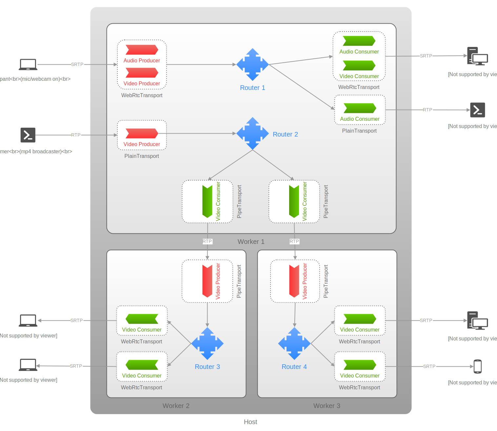

# SFU (Selective Forwarding Unit)

An SFU (Selective Forwarding Unit) takes audio and video streams from different users and sends them to everyone else. Each user sends one stream and gets many in return. Users can choose which streams and parts of the streams they want to receive.

Compared to an MCU (Multipoint Conferencing Unit), which combines and processes the streams, an SFU is faster, handles more data, and uses fewer resources because it doesn't need to process or mix the media.

Since users get each other's media streams separately, they can customize their layout and decide which streams to show and how to display them.

